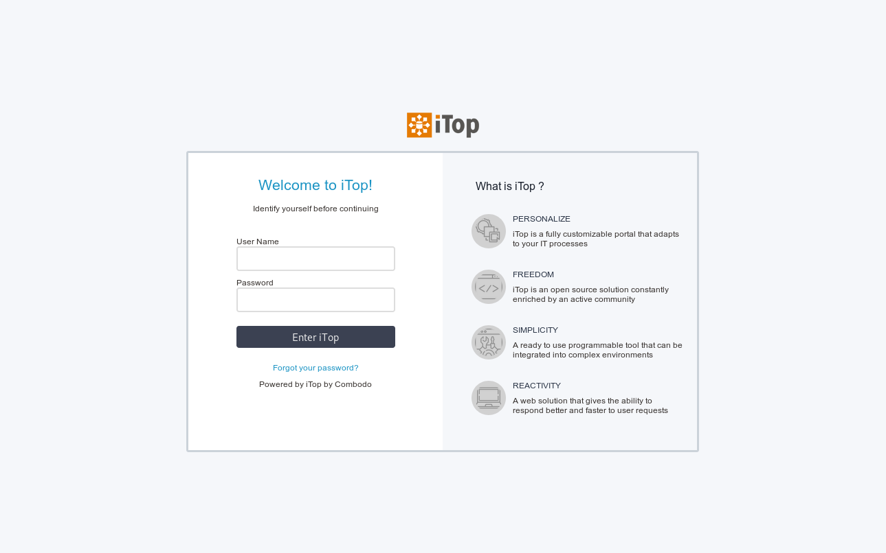

# Sample login custom content

This extension is a preview of what is achievable through our new login page (iTop >= 2.7)



It features :
* A redefinition of ```base.html.twig``` to add markup used for display
* An overload of ```additional_content.html.twig``` to add data to the login screen (right pane)
* A custom css to customize login screen page